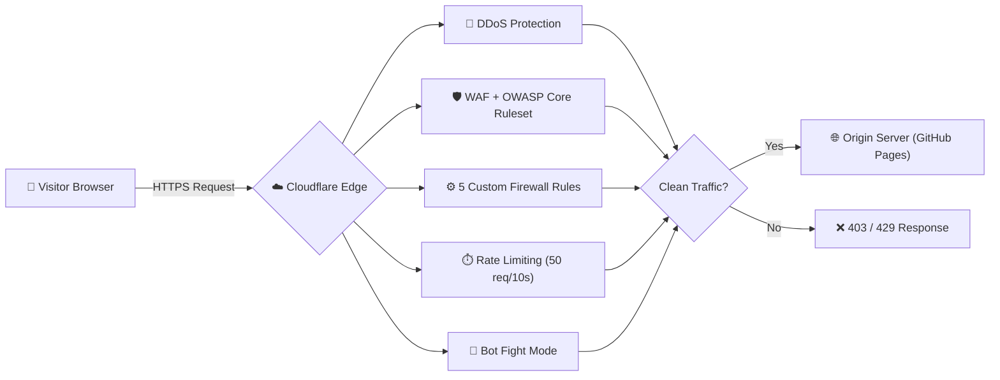

<div align="center">

# 🛡️ Cloud-Based Firewall for Website Protection

### Internship Project · Cloudflare WAF, DDoS & Rate-Limiting Defense

[](https://sefali-portfolio.vercel.app/)
[](https://sefali-portfolio.vercel.app/)
[](https://www.linkedin.com/in/sefaligupta)
[](https://github.com/Sefali12)


</div>

---

## 📌 Objective

Design and configure a **cloud firewall** to protect a live website using **Cloudflare** — enabling firewall rules, a Web Application Firewall (WAF), attack monitoring, and full documentation of how cloud-based web protection works end to end.

## 🧭 Project Overview

This project puts Cloudflare in front of a live website as an **edge security layer**. Every HTTP/HTTPS request is routed through Cloudflare, inspected at the edge, and only clean traffic is forwarded to the origin (GitHub Pages). It demonstrates enterprise-grade web security on a free-tier budget: WAF, DDoS protection, rate limiting, bot mitigation, and real-time threat monitoring — validated with 29 controlled attack simulations.

## 📊 Architecture



## 🛡️ Security Features

| Feature | Detail |
|---|---|
| **WAF** | Cloudflare Managed Ruleset + OWASP Core Ruleset (Paranoia Level 2) |
| **Custom Firewall Rules** | 5 rules — SQLi, XSS, malicious bots/scanners, path traversal/LFI, geo-risk challenge |
| **Rate Limiting** | 50 requests / 10 seconds per IP, blocks for 1 minute |
| **DDoS Protection** | Cloudflare's automatic Layer 7 mitigation (always on) |
| **Bot Fight Mode** | Challenges/blocks non-human traffic; verified search bots exempt |
| **SSL/TLS** | Full (Strict), TLS 1.2 minimum, HTTPS enforced everywhere |

## 🔧 Technologies Used

| Technology | Purpose |
|---|---|
| Cloudflare | Cloud firewall, CDN, DNS, WAF |
| GitHub Pages | Static origin hosting |
| DNS / Nameservers | Domain routing |
| HTTPS | Secure communication |
| PowerShell | Attack-simulation / test scripts |

---

## 🪜 Full Step-by-Step Walkthrough

<details>
<summary><b>Step 1 — Prerequisites & Website Setup</b></summary>

1. Created a public GitHub repository and a simple static `index.html` showing firewall/protection status.
2. Enabled **GitHub Pages** (Settings → Pages → Source: `main` branch).
3. Connected the custom domain in GitHub Pages settings.

📄 Full detail: [`reports/01-prerequisites.md`](./reports/01-prerequisites.md)
</details>

<details>
<summary><b>Step 2 — Cloudflare Integration</b></summary>

1. Added the domain to Cloudflare (Free plan).
2. Updated the domain's **nameservers** at the registrar to Cloudflare's assigned nameservers, and verified propagation with `Resolve-DnsName <domain> -Type NS`.
3. Set **SSL/TLS mode to Full (Strict)**, enabled **Always Use HTTPS**, set **minimum TLS version to 1.2**, and enabled **Automatic HTTPS Rewrites**.
4. Configured DNS records (A/CNAME) with the **orange-cloud proxy** enabled, so all traffic routes through Cloudflare.
5. Verified proxying by checking the `cf-ray` response header — confirms which Cloudflare edge location served the request.

📄 Full detail: [`reports/02-cloudflare-integration.md`](./reports/02-cloudflare-integration.md)
</details>

<details>
<summary><b>Step 3 — Firewall Rules Configuration</b></summary>

Configured 5 custom rules + 1 rate-limiting rule in **Security → WAF → Custom Rules**:

| # | Rule | Action | Blocks |
|---|---|---|---|
| 1 | Block SQL Injection | Block | `select`, `union`, `drop`, `--`, `/*` patterns in query strings |
| 2 | Block XSS & Script Injection | Block | `<script`, `javascript:`, `onerror=`, `eval(`, `document.cookie` |
| 3 | Block Malicious Bots & Scanners | Block | `sqlmap`, `nikto`, `nmap`, `nessus`, `acunetix`, empty user-agent |
| 4 | Block Path Traversal & LFI/RFI | Block | `../`, `/etc/passwd`, `.env`, `.git`, `.htaccess`, `wp-config` |
| 5 | Block High-Risk Countries | Managed Challenge | Geo-based CAPTCHA challenge |
| 6 | Rate Limit — DDoS Protection | Block | 50 requests / 10s per IP on `/`, `/api`, `/login`, `/admin` |

📄 Full detail + exact rule expressions: [`reports/03-firewall-rules.md`](./reports/03-firewall-rules.md)
</details>

<details>
<summary><b>Step 4 — WAF Configuration</b></summary>

1. Enabled the **Cloudflare Managed Ruleset** (default action: Managed Challenge).
2. Enabled the **OWASP Core Ruleset** at Paranoia Level 2, anomaly threshold 25+.
3. Set **Security Level** to Medium and enabled **Browser Integrity Check**.
4. Enabled **Bot Fight Mode** and **Block AI Scrapers** (search-engine bots exempted).
5. Confirmed **HTTP DDoS Attack Protection** and **Network-layer DDoS Protection** were active by default.

📄 Full detail: [`reports/04-waf-configuration.md`](./reports/04-waf-configuration.md)
</details>

<details>
<summary><b>Step 5 — Monitoring & Logging</b></summary>

1. Used **Security → Events** to review real-time blocked requests — action taken, rule triggered, source IP, country, user-agent, and Ray ID.
2. Used **Security → Analytics** to track total threats blocked, threats by country/type, and top offending IPs over 24h / 7d / 30d windows.
3. Logged every test run in a results table (time, test, source, result, rule triggered) for traceability.

📄 Full detail: [`reports/05-monitoring-logging.md`](./reports/05-monitoring-logging.md)
</details>

<details>
<summary><b>Step 6 — Security Testing (Attack Simulation)</b></summary>

1. Ran controlled attacks with `curl` (Windows) against the protected domain: SQL injection payloads, XSS payloads, path traversal attempts, and requests spoofing known scanner user-agents (`sqlmap`, etc.).
2. Verified every malicious request returned **HTTP 403 Blocked**, and normal requests returned **HTTP 200**.
3. **Result: 29/29 malicious requests blocked (100%)** across SQLi, XSS, bots, and path traversal categories.

📄 Full detail: [`reports/07-security-testing.md`](./reports/07-security-testing.md)
</details>

<details>
<summary><b>Step 7 — DDoS & Rate-Limit Load Testing</b></summary>

1. Ran [`test-rate-limit.ps1`](./test-rate-limit.ps1) — sequential flooding + brute-force simulation against the homepage and a login endpoint.
2. Ran [`test-ddos-aggressive.ps1`](./test-ddos-aggressive.ps1) — 70 **parallel** PowerShell background jobs firing requests simultaneously to simulate a real burst.
3. Confirmed the rate-limit rule triggered **HTTP 429 Too Many Requests** once the 50-req/10s threshold was crossed, with progressive blocking on sustained bursts.

📄 Full detail: [`ddos-test-results.md`](./ddos-test-results.md)
</details>

<details>
<summary><b>Step 8 — OWASP Top 10 Mapping</b></summary>

Mapped each custom rule and WAF control against the OWASP Top 10 category it mitigates (e.g., A03:2021-Injection → SQLi/XSS rules, A01:2021-Broken Access Control → path traversal rule), and specifically tested **A01: Broken Access Control** against admin paths and sensitive files (`.git`, `.env`).

📄 Full detail: [`owasp-tests/A01-broken-access-control.md`](./owasp-tests/A01-broken-access-control.md)
</details>

<details>
<summary><b>Step 9 — Final Report</b></summary>

Consolidated the full build, configuration, and test evidence into one executive write-up covering objectives, methodology, results, and key learnings.

📄 Full detail: [`reports/06-final-report.md`](./reports/06-final-report.md)
</details>

---

## 🧪 Test Results

| Attack Type | Result |
|---|---|
| SQL Injection (6) | 🛡️ Blocked |
| XSS Attacks (13) | 🛡️ Blocked |
| Path Traversal (`.env`, `.git`) (4) | 🛡️ Blocked |
| Malicious Bots (sqlmap etc.) (6) | 🛡️ Blocked |
| Normal Traffic | ✅ Allowed |

Rate limiting was separately verified with 70-request parallel bursts, which triggered HTTP `429 Too Many Requests` — see [`ddos-test-results.md`](./ddos-test-results.md).

## 📈 Project Status

| Step | Description | Status |
|---|---|---|
| 1 | Domain & Hosting Setup | ✅ Complete |
| 2 | Cloudflare Integration | ✅ Complete |
| 3 | Firewall Rules (5 Custom + 1 Rate Limit) | ✅ Complete |
| 4 | WAF Configuration | ✅ Complete |
| 5 | Monitoring & Analytics | ✅ Complete |
| 6 | Final Documentation | ✅ Complete |

## 📁 Repository Structure

```
.
├── Abstract.txt                  # Project abstract
├── ddos-test-results.md          # Rate limiting / DDoS test log
├── test-rate-limit.ps1           # Rate-limit test script
├── test-ddos-aggressive.ps1      # Aggressive parallel-burst test script
├── ppt.txt                       # Slide-deck content/prompt for presentation
├── docs/                         # Demo site used as the protected target
│   ├── index.html
│   ├── admin/                    # Demo admin pages (attack-surface target)
│   └── config/                   # Demo config page (attack-surface target)
├── owasp-tests/                  # OWASP Top 10 category test reports
│   └── A01-broken-access-control.md
└── reports/                      # Step-by-step build & testing documentation
    ├── 01-prerequisites.md
    ├── 02-cloudflare-integration.md
    ├── 03-firewall-rules.md
    ├── 04-waf-configuration.md
    ├── 05-monitoring-logging.md
    ├── 06-final-report.md
    └── 07-security-testing.md
```

## 🎯 Deliverables

- ✅ Live protected website
- ✅ 5 custom firewall rules + 1 rate-limiting rule
- ✅ WAF with OWASP Core Ruleset
- ✅ Security monitoring dashboard walkthrough
- ✅ OWASP Top 10 protection mapping
- ✅ 100% attack block rate verified across 29 tests

## 📚 Technologies Required (per internship brief)

- Cloudflare platform
- DNS and nameserver concepts
- HTTP/HTTPS basics
- Web security (OWASP Top 10)
- Basic networking concepts

---

## 👩‍💻 Author

**Sefali Gupta**
Final-year B.Tech (IT), Institute of Engineering and Management, Kolkata

[](https://sefali-portfolio.vercel.app/)
[](https://www.linkedin.com/in/sefaligupta)
[](https://github.com/Sefali12)
[](https://leetcode.com/u/sefaligupta/)

Licensed under [MIT](./LICENSE).
